<h3>
  
 Welcome!

</h3>

## 🧪&nbsp;&nbsp;&nbsp;Want to dive deep into computer science?

I love exploring fascinating computer science topics that go beyond typical day-to-day work. Join me on this journey of discovery!

<table>
  <tr>
    <td></td>
    <td>Learn about reverse engineering using a GBA game as a case study</td>
    <td width="30%">
      🎥 With talks (🇺🇸) 
      📄 With blogposts (🇺🇸 / 🇧🇷 / 🇪🇸)
    </td>
  </tr>
  <tr>
    <td></td>
    <td>Demystifying compilers by writing your own</td>
    <td>
      🎥 With talks (🇺🇸 / 🇧🇷)
    </td>
  </tr>
</table>

## 🧑‍💻&nbsp;&nbsp;&nbsp;VS Code Extensions

Love VS Code? Check out my extensions for the [Fluent language](https://projectfluent.org/) and reverse engineering!

<table>
  <tr>
    <td></td>
    <td></td>
  </tr>
</table>

## 🐒&nbsp;&nbsp;&nbsp;Community

I'm the organizer of [**GambiConf**](https://gambiconf.dev/), an event for Portuguese-speaking audiences inspired by [!!Con](https://bangbangcon.com/) that celebrates the joy and playful side of the computing.

I also speak at various events. Some of my favorite presentations:

- 🇺🇸 [Demystifying compilers by writing your own](https://www.youtube.com/watch?v=zMJYoYwOCd4)
- 🇺🇸 [The day I reverse engineered a furry Gameboy Advance game](https://www.youtube.com/watch?v=RMM_5bq3Ct8)
- 🇺🇸 [Fluent: A localization system for natural-sounding translations](https://www.youtube.com/watch?v=kHHFcuQq70k&t=357s)
- 🇧🇷 [Charadinhas de JavaScript](https://www.youtube.com/live/HdoPos3O8Mg?t=2105s)

[See all my talks here.](https://macabeus.github.io/talks)

## 🔧&nbsp;&nbsp;&nbsp;Current Projects

I'm currently working on:

- [Game decompilation using AI](https://gambiconf.substack.com/p/development-journey-on-game-decompilation)

## 🌐&nbsp;&nbsp;&nbsp;Connect with Me

- <a href="http://macabeus.github.io/">Website</a>
- <a href="https://www.twitch.tv/bmacabeus">Twitch</a>
- <a href="https://twitter.com/bmacabeus">Twitter</a>
- <a href="https://bsky.app/profile/macabeus.bsky.social">Bluesky</a>
- <a href="https://www.linkedin.com/in/macabeus">LinkedIn</a>
